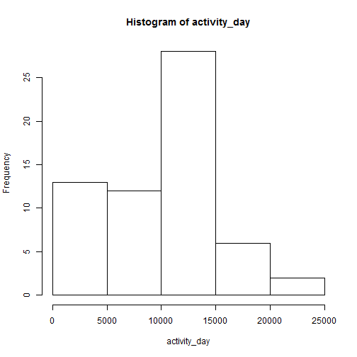
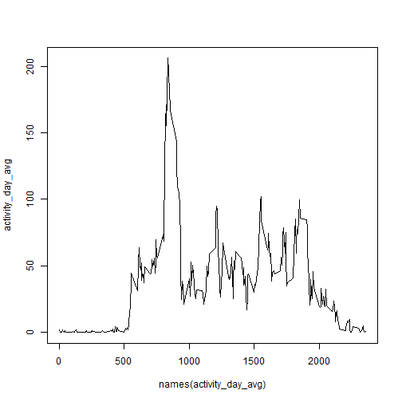
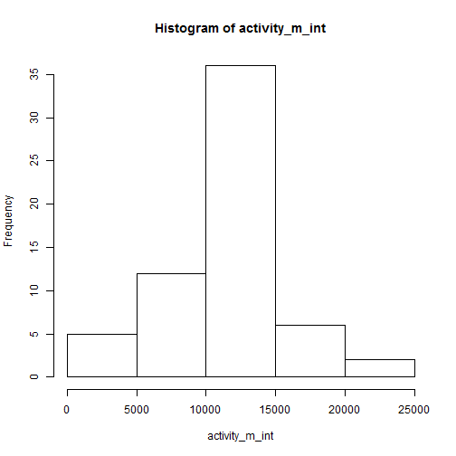
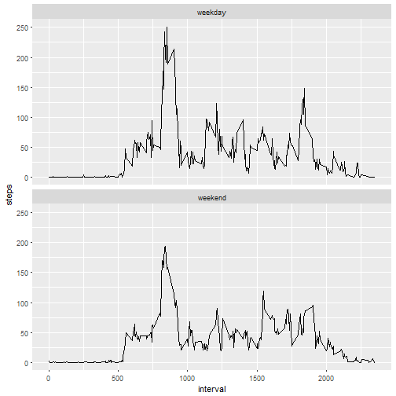

## Loading and preprocessing the data

Read the data file in.

```r
activity <- read.csv("activity.csv")
```
Change the date column to the correct format

```r
activity$date <- as.Date(activity$date,"%Y-%m-%d")
```

## What is mean total number of steps taken per day?
Sum the number of steps per day

```r
activity_day <- tapply(activity$steps,activity$date,sum,na.rm=TRUE)
```
Create histogram

```r
hist(activity_day)
```



Calculate mean and median of steps taken per day

```r
mean(activity_day)
```

```
## [1] 9354.23
```

```r
median(activity_day)
```

```
## [1] 10395
```

## What is the average daily activity pattern?
Calculate the average number of steps by 5 minutes interval

```r
activity_day_avg <- tapply(activity$steps,activity$interval,mean,na.rm=TRUE)
```
Plot a times series

```r
plot(names(activity_day_avg),activity_day_avg, type = "l")
```



Which 5-minute interval, on average across all the days in the dataset, contains the maximum number of steps?

```r
activity_day_avg[which.max(activity_day_avg)]
```

```
##      835 
## 206.1698
```

## Imputing missing values
Calculate and report the total number of missing values in the dataset (i.e. the total number of rows with NAs)

```r
count(is.na(activity$steps))
```

```
##       x  freq
## 1 FALSE 15264
## 2  TRUE  2304
```
Strategy to fill missing values : use the average number of steps by 5 minutes interval

```r
df <- data.frame(activity_day_avg)
df <- cbind(df, interval=rownames(df))
activity_m <- merge(activity,df, all.x = TRUE)
```
Create a new dataset that is equal to the original dataset but with the missing data filled in.

```r
activity_m[is.na(activity_m$steps),"steps"] <- activity_m[is.na(activity_m$steps),"activity_day_avg"]
```
Make a histogram of the total number of steps taken each day and Calculate and report the mean and median total number of steps taken per day

```r
activity_m_int <- tapply(activity_m$steps,activity_m$date,sum)
hist(activity_m_int)
```



Calculate and report the mean and median total number of steps taken per day

```r
mean(activity_m_int)
```

```
## [1] 10766.19
```

```r
median(activity_m_int)
```

```
## [1] 10766.19
```

It looks like the imputing of NA values increases the middle bar (mean/median) height and decreses the 0-5000 bar which seems logical according to the strategy we choosed to fill missing values (using the average)

## Are there differences in activity patterns between weekdays and weekends?
Create a new factor variable in the dataset with two levels -- "weekday" and "weekend" 

```r
activity_m$weekday <- as.factor(ifelse(weekdays(activity_m$date) < "Saturday","weekday","weekend"))
library(plyr)
activity_m_day_avg <- ddply(activity_m,c("interval","weekday"), function(x) colMeans(x["steps"]))
```
Make a panel plot containing a time series plot of the 5-minute interval and the average number of steps taken, averaged across all weekday days or weekend days.

```r
library(ggplot2)
ggplot(activity_m_day_avg,aes(x = interval, y = steps)) + 
    geom_line(stat="identity") + 
    facet_wrap(~ weekday, nrow = 2) 
```


